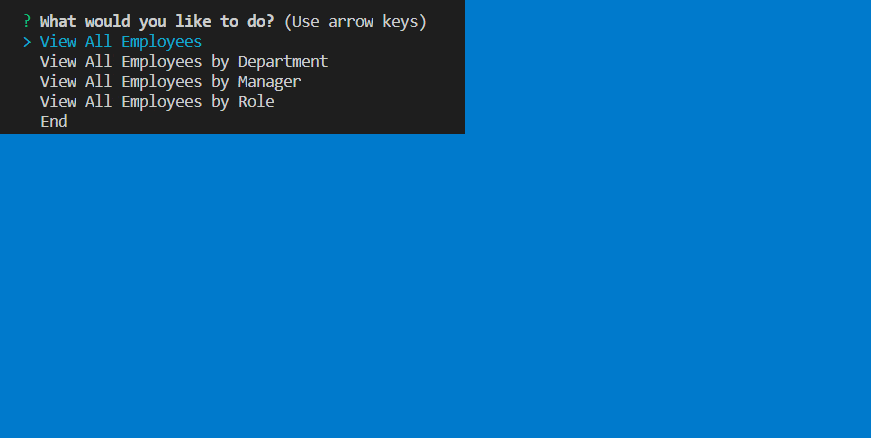

# Employee-Management-System
# Unit 12 MySQL Homework: Employee Tracker

Developers are often tasked with creating interfaces that make it easy for non-developers to view and interact with information stored in databases. Often these interfaces are known as **C**ontent **M**anagement **S**ystems. This program is a solution for managing a company's employees using node, inquirer, and MySQL.

# Example Run Through

